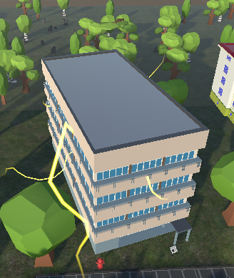
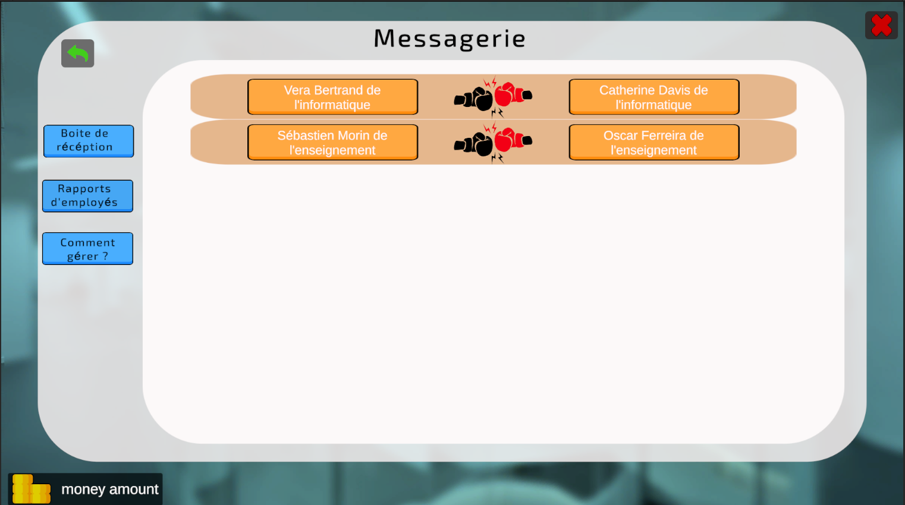

# Campus Of Legends

## What is "Campus Of Legends"?

**Campus Of Legends** is a human resources management simulation game set on a chaotic university campus. Your mission? As the Vice President of Human Resources, you must turn **UNISTRA** into an attractive campus capable of competing with the best universities in the world!

Throughout the 8 semesters of your mandate, you'll have to make strategic decisions to restore order, improve attractiveness, and ensure the campus's prosperity. You'll build a team that will play a crucial role in managing the allocated budget each semester. But beware: random events will spice up your experience, such as fires, internal conflicts, cyberattacks, and other unexpected challenges.

Every piece of data (salaries, budgets, etc.) is based on real, public information, for a fully immersive experience. Tips in the form of advice will guide you along your adventure, but it will be up to you to adopt an effective strategy to make the campus thrive.

  
  
  
  

## Who are we?

We are four students from the **IUT Robert Schuman** at the University of Strasbourg (**Unistra**), who are passionate about computer science. This game was developed as part of a university project to create a "serious game" on the theme of the **Vice President of Human Resources**. We mobilized the skills we'd acquired in our first year, and worked on Unity ourselves, to complete the project in just three months.

## What can you do in _Campus Of Legends_?

Our management simulator puts you in the shoes of a Vice President of HR facing realistic and demanding challenges. Every decision has consequences, and your strategy will be put to the test.

Here’s what you can do:

- **Recruit employees** with diverse profiles from various professions.
- **Organize training sessions** to improve your team's skills.
- **Allocate bonuses** to ease conflicts and reduce the risk of resignations.
- **Make layoffs** if necessary.
- **Dialogue with employees** to assess their morale and expectations.
- **Explore various campus buildings**, each dedicated to a specific management aspect (recruitment, training, crisis management).
- **Handle crisis events**, such as incidents affecting staff or finances.
- **Manage the budget**, which depends on the university's attractiveness.
- **Advance through time**, semester by semester, to evaluate the impact of your decisions.

Each action will help you understand the responsibilities and challenges of human resources management in a university context. By playing, you’ll develop skills that can be transposed to the management of real organizations.

## Installation Instructions

The project was developed with **Unity** and is easy to install.

### Download Link

Click on this link to download the game:

[**Download Link**](https://seafile.unistra.fr/d/1c3ebc8b5bbc42d29f3a/)

If this link doesn't work, use this alternative: https://seafile.unistra.fr/d/1c3ebc8b5bbc42d29f3a/

### WINDOWS

1. Download and open the file _CampusOfLegendsSetup.exe_.
2. Follow the installer instructions.

**Note:** A security warning may appear during execution. This is due to the absence of a digital signature on the executable. If you have any doubts, you can run the game directly from Unity by opening the project folder.

### LINUX

1. Download the "Linux" folder from the link.
2. Open the file _CampusOfLegendLinuxVersion.x86_64_.

### MAC OS

1. Download the "MAC" folder from the link.
2. Open the file _GAME.app_.

### Support

If an executable doesn't work correctly, please contact support at:

**git-reply+dee24-t3-c-dee24-t3-c-42281-issue-@unistra.fr**

**Note:** A rare bug may cause a crash when transitioning to the next semester. We are actively working to resolve this issue.

If you get stuck on the game map, you can press the R key to reset your position.

## Contributors

- [Amine Belhaj](https://github.com/Artemis1799)
- Antoine Chaumet
- Alexandre Couton
- Auguste Delaye

---

We hope you enjoy your experience with _Campus Of Legends_! Please let us know if you have any feedback or suggestions for improving the game.
