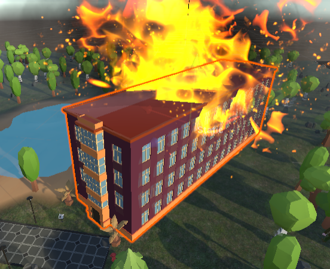
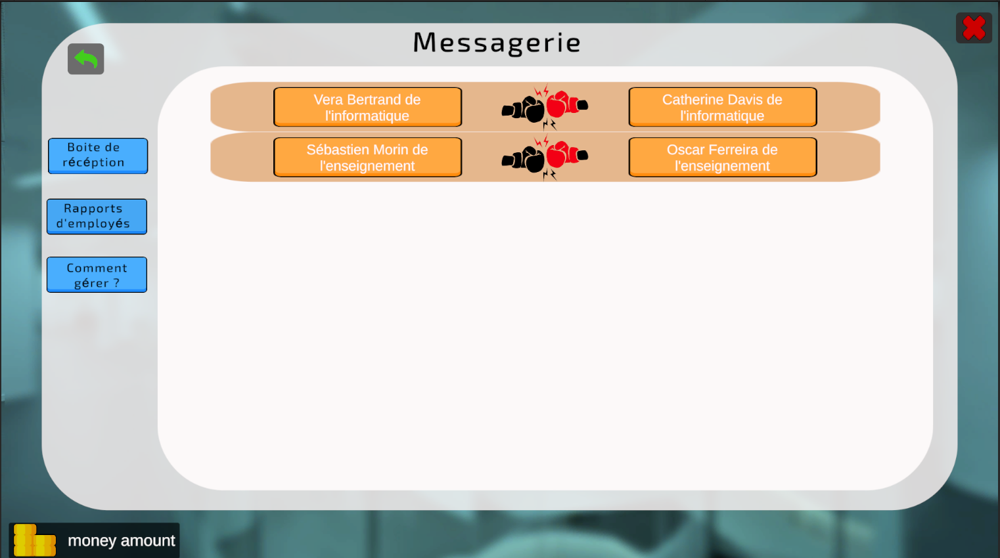

# Campus Of Legends

## Qu'est-ce que "Campus Of Legends" ?

**Campus Of Legends** est un jeu de simulation de gestion des ressources humaines dans un campus universitaire en plein chaos. Votre mission ? En tant que vice-président des ressources humaines, redresser l'**UNISTRA** et en faire un campus attractif, capable de rivaliser avec les meilleures universités du monde !

Tout au long des 8 semestres de votre mandat, vous devrez prendre des décisions stratégiques pour rétablir l'ordre, améliorer l'attractivité et assurer la prospérité du campus. Vous constituerez une équipe qui jouera un rôle crucial dans la gestion du budget alloué chaque semestre. Mais attention : des événements aléatoires viendront pimenter votre expérience, tels que des incendies, des conflits internes, des piratages informatiques, et bien d'autres péripéties.

Chaque donnée (salaire, budget, etc.) s'appuie sur des informations réelles et publiques, pour une immersion totale. Des astuces sous forme de conseils vous guideront tout au long de votre aventure, mais il vous reviendra d'adopter une stratégie efficace pour faire prospérer le campus.

  
  
  
  

## Qui sommes-nous ?

Nous sommes quatre étudiants passionnés d'informatique, issus de l'**IUT Robert Schuman** de l'Université de Strasbourg (**Unistra**). Ce jeu a été développé dans le cadre d'un projet universitaire de création d'un "jeu sérieux" sur le thème du **vice-président des ressources humaines**. Nous avons mobilisé nos compétences acquises en première année et travaillé de manière autodidacte sur Unity pour réaliser ce projet en seulement trois mois.

## Que peut-on faire dans _Campus Of Legends_ ?

Notre simulateur de gestion vous plonge dans la peau d'un vice-président RH face à des défis réalistes et exigeants. Chaque décision a des conséquences, et votre stratégie sera mise à l'épreuve.

Voici ce que vous pourrez accomplir :

- **Recruter des employés** aux profils variés, issus de différentes professions.
- **Organiser des formations** pour améliorer les compétences de votre équipe.
- **Octroyer des primes** pour apaiser les conflits et réduire le risque de démissions.
- **Procéder à des licenciements** si nécessaire.
- **Dialoguer avec les employés** pour évaluer leur moral et leurs attentes.
- **Explorer les différents bâtiments** du campus, chacun dédié à un aspect de la gestion (recrutement, formation, gestion des crises).
- **Gérer des crises événementielles**, comme des incidents affectant le personnel ou les finances.
- **Superviser le budget**, dont l'attribution dépend de l'attractivité de l'université.
- **Progresser dans le temps**, semestre après semestre, pour évaluer l'impact de vos décisions.

Chaque action vous aidera à comprendre les responsabilités et défis de la gestion des ressources humaines dans un contexte universitaire. En jouant, vous développerez des compétences transposables à la gestion d'organisations réelles.

## Instructions d'installation

Le projet a été développé avec **Unity** et est facile à installer.

### Lien de téléchargement

Cliquez sur ce lien pour télécharger le jeu :

[**Lien de téléchargement**](https://seafile.unistra.fr/d/1c3ebc8b5bbc42d29f3a/)

Si cela ne fonctionne pas, utilisez ce lien : https://seafile.unistra.fr/d/1c3ebc8b5bbc42d29f3a/

### WINDOWS

1. Téléchargez et ouvrez le fichier _CampusOfLegendsSetup.exe_.
2. Suivez les instructions de l'installateur.

**Note :** Un avertissement de sécurité peut apparaître lors de l'exécution. Cela est dû à l'absence de signature numérique sur l'exécutable. Si vous avez des doutes, vous pouvez lancer le jeu directement depuis Unity en ouvrant le dossier du projet.

### LINUX

1. Téléchargez le dossier "Linux" depuis le lien.
2. Ouvrez le fichier _CampusOfLegendLinuxVersion.x86_64_.

### MAC OS

1. Téléchargez le dossier "MAC" depuis le lien.
2. Ouvrez le fichier _GAME.app_.

### Support

Si un exécutable ne fonctionne pas correctement, contactez le support à l'adresse suivante :

**git-reply+dee24-t3-c-dee24-t3-c-42281-issue-@unistra.fr**

**Note :** Un bug rare peut provoquer un crash lorsque vous passez au semestre suivant. Nous travaillons activement à le résoudre.

Si vous êtes bloqué sur la carte du jeu, vous pouvez également appuyer sur la touche R pour réinitialiser votre position.

## Participants

- [Amine Belhaj](https://github.com/Artemis1799)
- Antoine Chaumet
- Alexandre Couton
- Auguste Delaye

---

Nous espérons que vous apprécierez votre expérience avec _Campus Of Legends_ ! N'hésitez pas à nous faire part de vos retours ou suggestions pour améliorer le jeu.
